# 📄 Project Report: Multiservice Application Deployment with Ansible and Consul-based Service Discovery

---

## Part 1: Remote Node Configuration via Ansible

### 📘 Обзор
В этой части мы настроим многосервисное приложения с помощью Ansible. Cоздадим три машины с помощью Vagrant (менеджер, node01, node02) и настроим node01 и node02 удаленно из менеджера. Задачи включают генерацию ключей SSH, копирование файлов Docker Compose и развертывание микросервисов с помощью плейбуков Ansible. Ansible используется для автоматизации установок Docker, развертывания микросервисов и настройки Apache/Postgres. Окончательный вывод включает успешные тестовые запуски Postman и проверку создания таблицы PostgreSQL.

---

### Создаем Vagranfile с тремя машинами: manager, node01, node02. Перенаправляем порты node01 на локальную машину для доступа к неразвернутому приложению микросервиса.
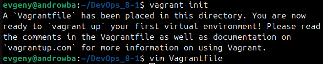

```ruby
Vagrant.configure("2") do |config|
  config.vm.box = "ubuntu/bionic64"

  config.vm.define "manager" do |manager|
    manager.vm.hostname = "manager"
    manager.vm.network "private_network", ip: "192.168.56.10"
    manager.vm.network "forwarded_port", guest: 22, host: 2222, id: "ssh"
    manager.vm.network "forwarded_port", guest: 8081, host: 8081
    manager.vm.network "forwarded_port", guest: 8082, host: 8082
    manager.vm.network "forwarded_port", guest: 8083, host: 8083
    manager.vm.network "forwarded_port", guest: 8084, host: 8084
    manager.vm.network "forwarded_port", guest: 8085, host: 8085
    manager.vm.network "forwarded_port", guest: 8086, host: 8086
    manager.vm.network "forwarded_port", guest: 8087, host: 8087
    manager.vm.provider "virtualbox" do |vb|
      vb.memory = "4096"
    end
  end

  config.vm.define "node01" do |node01|
    node01.vm.hostname = "node01"
    node01.vm.network "private_network", ip: "192.168.56.11"
    node01.vm.network "forwarded_port", guest: 80, host: 8080, host_ip: "127.0.0.1"
    node01.vm.network "forwarded_port", guest: 22, host: 2223, id: "ssh"
    node01.vm.provider "virtualbox" do |vb|
      vb.memory = "1024"
    end
  end

  config.vm.define "node02" do |node02|
    node02.vm.hostname = "node02"
    node02.vm.network "private_network", ip: "192.168.56.12"
    node02.vm.network "forwarded_port", guest: 22, host: 2224, id: "ssh"

    node02.vm.provider "virtualbox" do |vb|
      vb.memory = "1024"
    end
  end
end
```

### Поднимаем виртуальные машины командой ```vagrant up``` 
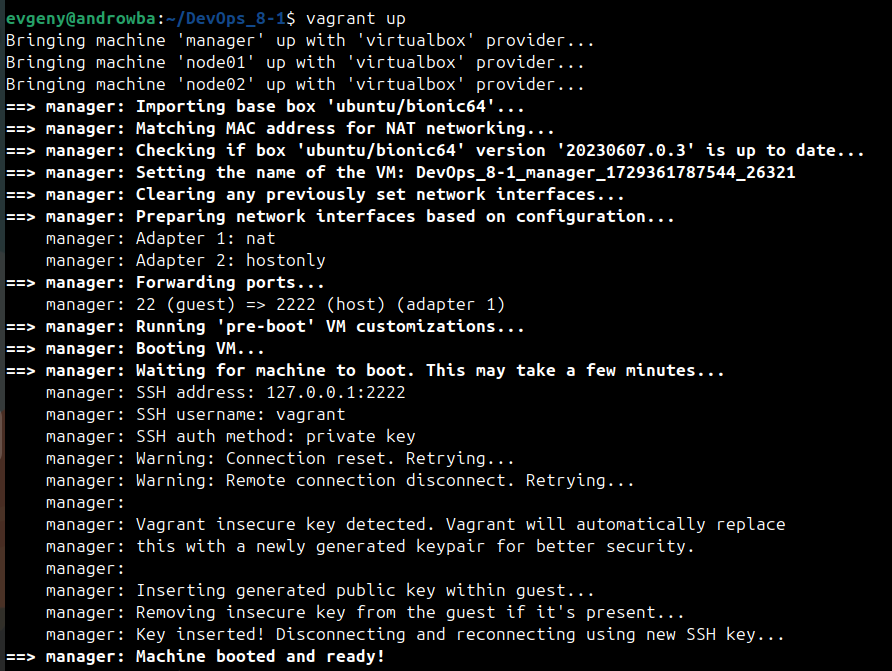

### Подключаемся к мэнеджеру через ssh для установки в нем Ansible командами:
```bash
sudo apt update
sudo apt install ansible -y
```

<p align="center">
  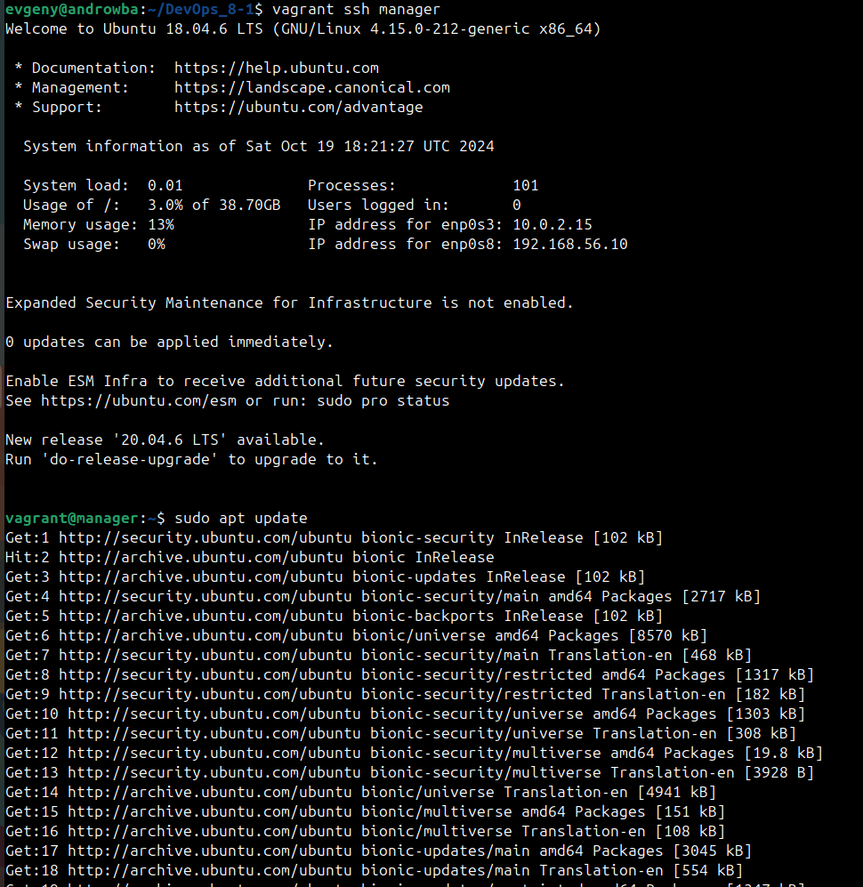
  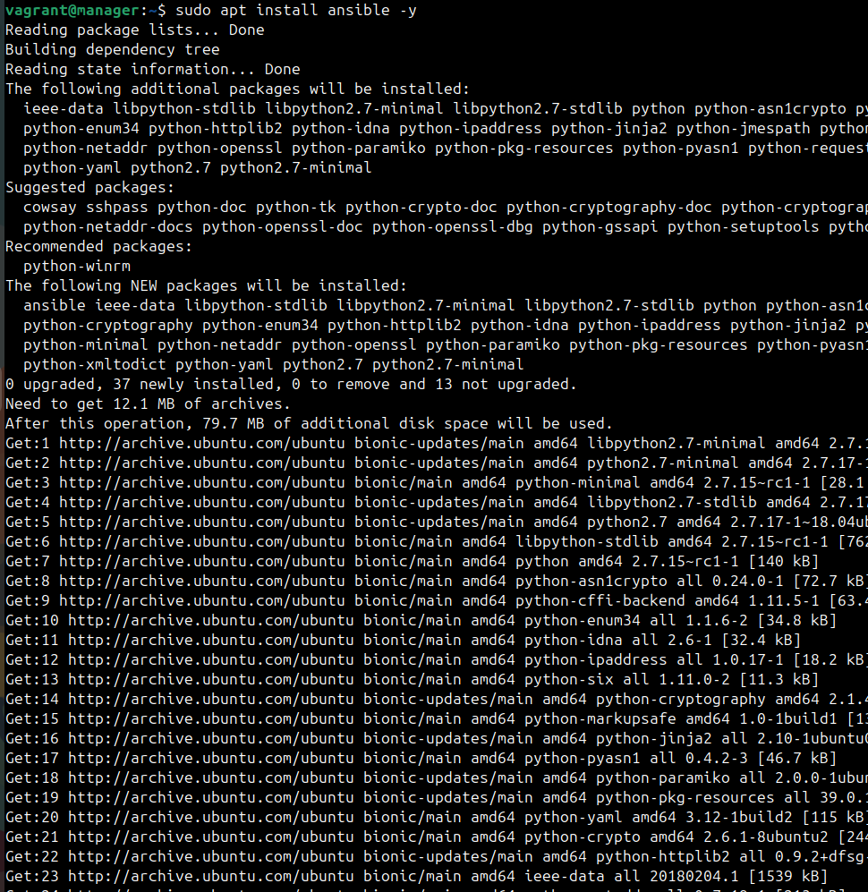
</p>

### Проверяем связь с машиной node01 по приватной сети:

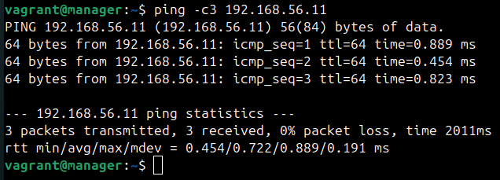

### Пробуем достучаться по SSH но получаем отказ в доступе (publickey). Это происходит из-за того, что аутентификация по ключу SSH еще не настроена, и машина Vagrant все еще ожидает метод аутентификации по паролю по умолчанию.
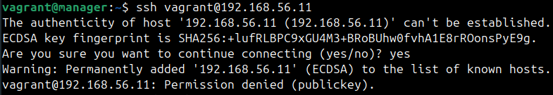

### Подготовим VM менеджер как рабочую станцию ​​для удаленной настройки: чтобы разрешить Ansible подключаться к node01 и node02 из менеджера, необходимо настроить аутентификацию на основе ключей SSH:

```bash
ssh-keygen -t rsa -b 4096 -C "ansible-manager" -N "" -f /home/vagrant/.ssh/id_rsa
```
```-t rsa```
Указывает тип алгоритма шифрования, который будет использоваться для пары ключей. В данном случае это генерация ключа RSA. RSA является одним из наиболее распространенных и широко поддерживаемых алгоритмов шифрования с открытым ключом.
```-b 4096```
Эта опция устанавливает количество бит в ключе. 4096 означает, что длина ключа составит 4096 бит. Более длинный ключ обеспечивает более высокую безопасность, но может занять немного больше времени для генерации и обработки. Ключи RSA могут иметь длину от 1024 до 4096 бит, причем 4096 является наиболее безопасным вариантом.
```-C "ansible-manager"```
Опция добавляет комментарий к ключу, который часто используется как метка или описание, помогающее идентифицировать ключ. В этом случае комментарий - "ansible-manager". Это полезно для того, чтобы узнать, для какой системы или цели был создан ключ. Комментарий необязателен и не влияет на безопасность ключа.
```-N ""```
Устанавливает пароль для закрытого ключа. В данном случае "" (пустые кавычки) означают, что пароль не установлен.

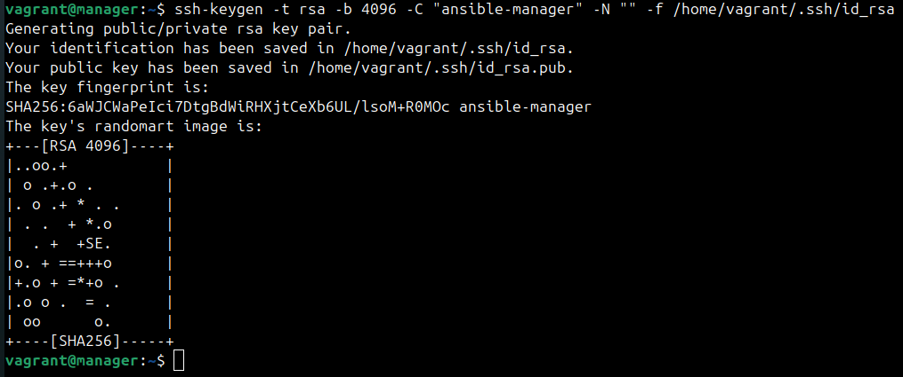

 ### Выводим сгенерированный ключ для дальнейшего копирования
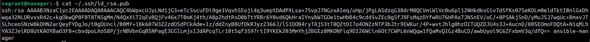

### Подключаемся к node01 и создаем файл authorized_keys куда и вставим наш public key 
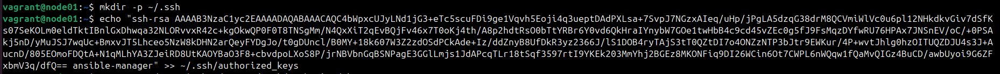

### Проделываем то же самое с node02
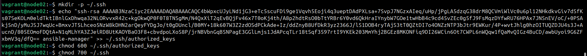

```chmod 600 ~/.ssh/authorized_keys```: защищает файл authorized_keys, так, что только владелец может читать и изменять его.
```chmod 700 ~/.ssh```: защищает каталог .ssh, так, что только владелец может получить к нему доступ, гарантируя, что другие пользователи не смогут видеть или изменять какие-либо файлы, связанные с SSH.

### Снова пытаемся проверить связь по SSH: все работает!
<p align="center">
  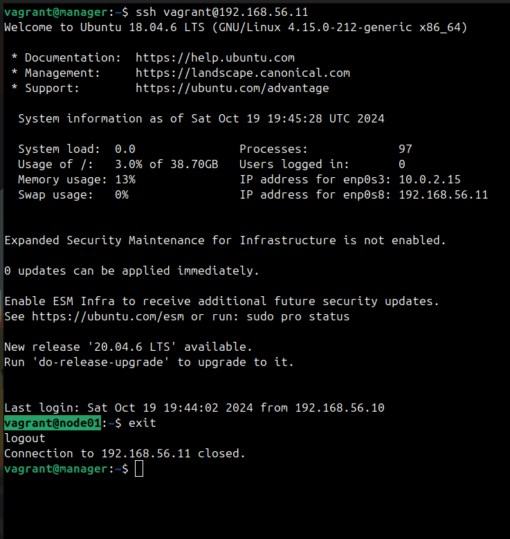
  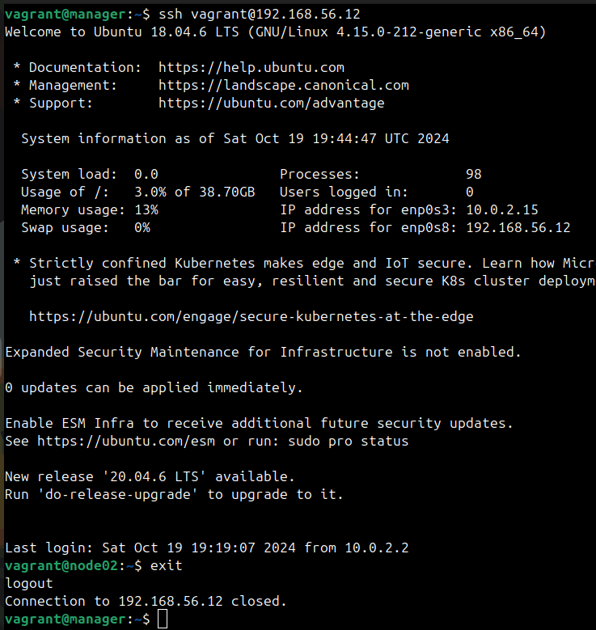
</p>

### Создаём папку Ansible и файл инвентаризации, после чего используем ping модуль для проверки соединения через Ansible.

```yml
[all]
node01 ansible_host=192.168.56.11 ansible_user=vagrant ansible_ssh_private_key_file=/home/vagrant/.ssh/id_rsa
node02 ansible_host=192.168.56.12 ansible_user=vagrant ansible_ssh_private_key_file=/home/vagrant/.ssh/id_rsa
```
```ansible_host```: IP-адрес узла.
```ansible_user```: Пользователь для подключения (в данном случае vagrant).
```ansible_ssh_private_key_file```: Путь к закрытому ключу SSH для аутентификации.

```all```: Применяет команду ко всем хостам, перечисленным в инвентаре.
```-i ~/ansible/inventory```: Указывает путь к файлу инвентаря.
```-m ping```: Использует модуль Ansible ping для проверки соединения.

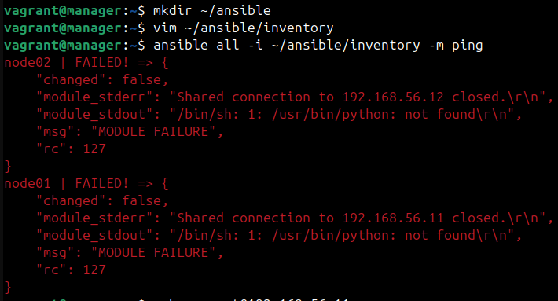

Ошибка ```"/usr/bin/python: not found"```, возникает из-за того, что Ansible требует установки Python на удаленных хостах (node01 и node02) для запуска своих модулей. По умолчанию Ansible использует Python 2.x или 3.x для своих операций, но на наших VM машинах Python не установлен.

### Устанавливаем Python вручную на каждой машине (если он еще не установлен) командой:

```bash
sudo apt update
sudo apt install python
```
### Пингуем еще раз - все работает!

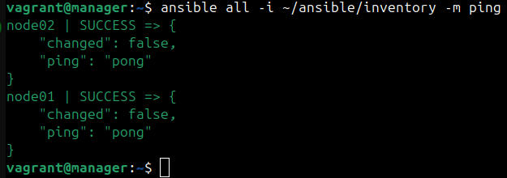

### Скопируем файл docker-compose и исходный код микросервисов в менеджер. (Скопируем сервисы из папки src и файл docker-compose из предыдущего проекта.)

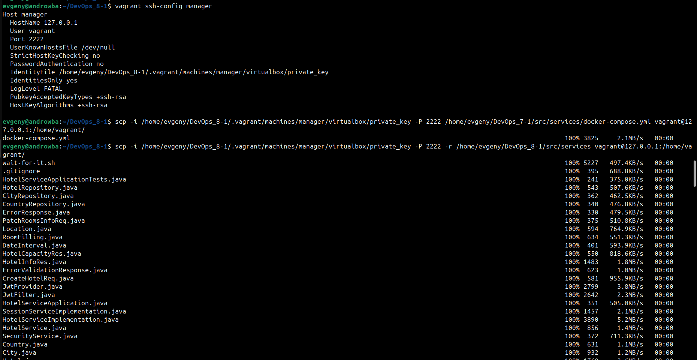
были использованы команды:
```bash
scp -i /home/evgeny/DevOps_8-1/.vagrant/machines/manager/virtualbox/private_key -P 2222 /home/evgeny/DevOps_7-1/src/services/docker-compose.yml vagrant@127.0.0.1:/home/vagrant/
scp -i /home/evgeny/DevOps_8-1/.vagrant/machines/manager/virtualbox/private_key -P 2222 -r /home/evgeny/DevOps_8-1/src/services vagrant@127.0.0.1:/home/vagrant/
```

### Проверяем в менеджере - все скопировалось. 
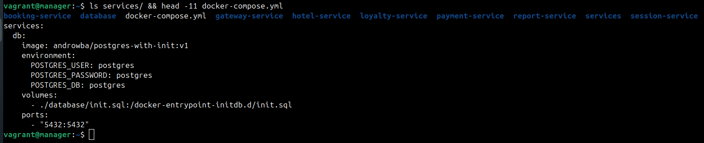

### Напишем первый сценарий для Ansible, который выполняет apt-обновление, устанавливает docker, docker-compose, копирует файл compose из менеджера и развертывает приложение микросервиса.

```yml
---
- hosts: manager
  become: yes
  tasks:
    - name: Update apt package manager
      apt:
        update_cache: yes

    - name: Install Docker
      apt:
        name: docker.io
        state: present

    - name: Install Docker Compose
      apt:
        name: docker-compose
        state: present

    - name: Copy docker-compose.yml to services directory
      copy:
        src: /home/vagrant/docker-compose.yml
        dest: /home/vagrant/services/docker-compose.yml
        owner: vagrant
        group: vagrant

    - name: Deploy the microservice application using Docker Compose
      command: docker-compose up -d
      args:
        chdir: /home/vagrant/services
```
```become: yes``` гарантирует, что все задачи в этом сценарии будут выполняться с повышенными привилегиями (sudo).
```chdir: /home/vagrant/services```: указывает, откуда должна быть запущена команда, именно сюда мы ранее скопировали docker-compose.yml.

### Добавляем ```ansible_connection=local``` в инвентарь для запуска в локальном режиме и запускаем playbook командой:
```bash
ansible-playbook -i ~/ansible/inventory ~/ansible/playbooks/docker_deploy.yml
```

```ansible_connection=local``` гарантирует, что все задачи выполняются непосредственно на виртуальной машине менеджера, минуя любую необходимость в SSH или протоколах удаленного подключения. Это распространенный подход при запуске Ansible playbooks на той же машине, где установлен Ansible

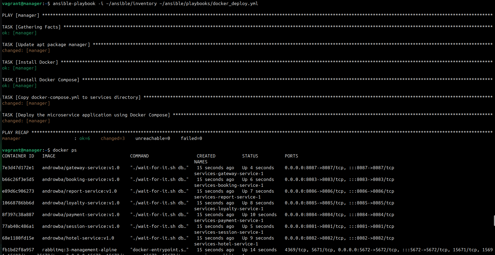

### Запускаем подготовленные тесты через Postman и убеждаемся, что все они прошли успешно.
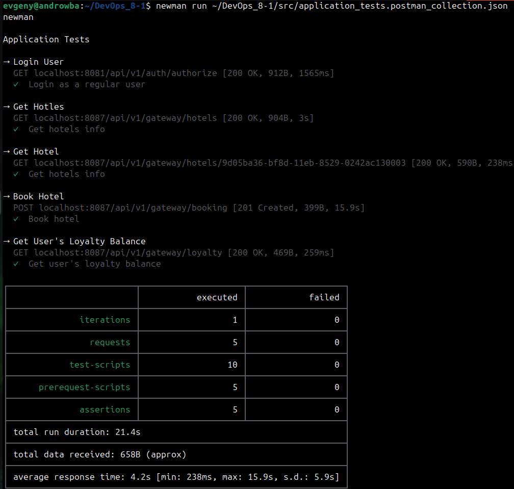
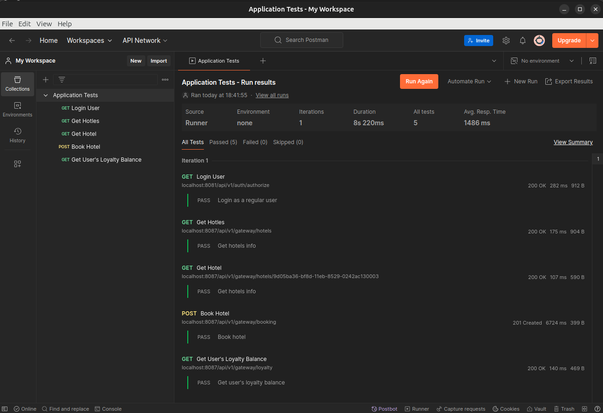

### Создание ролей

Перенаправим порты 8081..8087 для node01, так же во избежание коллизии портов - меняем порты в менеджере с 8081 на 9081
```ruby
Vagrant.configure("2") do |config|
  config.vm.box = "ubuntu/bionic64"

  config.vm.define "manager" do |manager|
    manager.vm.hostname = "manager"
    manager.vm.network "private_network", ip: "192.168.56.10"
    manager.vm.network "forwarded_port", guest: 22, host: 2222, id: "ssh"
    manager.vm.network "forwarded_port", guest: 8081, host: 9081
    manager.vm.network "forwarded_port", guest: 8082, host: 9082
    manager.vm.network "forwarded_port", guest: 8083, host: 9083
    manager.vm.network "forwarded_port", guest: 8084, host: 9084
    manager.vm.network "forwarded_port", guest: 8085, host: 9085
    manager.vm.network "forwarded_port", guest: 8086, host: 9086
    manager.vm.network "forwarded_port", guest: 8087, host: 9087
    manager.vm.provider "virtualbox" do |vb|
      vb.memory = "4096"
    end
  end

  config.vm.define "node01" do |node01|
    node01.vm.hostname = "node01"
    node01.vm.network "private_network", ip: "192.168.56.11"
    node01.vm.network "forwarded_port", guest: 80, host: 8080, host_ip: "127.0.0.1"
    (8081..8087).each do |port|
      node01.vm.network "forwarded_port", guest: port, host: port
    end
    node01.vm.network "forwarded_port", guest: 22, host: 2223, id: "ssh"
    node01.vm.provider "virtualbox" do |vb|
      vb.memory = "4096"
    end
  end

  config.vm.define "node02" do |node02|
    node02.vm.hostname = "node02"
    node02.vm.network "private_network", ip: "192.168.56.12"
    node02.vm.network "forwarded_port", guest: 22, host: 2224, id: "ssh"
    node02.vm.provider "virtualbox" do |vb|
      vb.memory = "4096"
    end
  end
end
```
### Для каждой роли создадим свой ```main.yml``` 

```css
ansible/
├── inventory
├── playbook.yml
└── roles/
    ├── application/
    │   └── tasks/
    │       └── main.yml
    ├── apache/
    │   └── tasks/
    │       └── main.yml
    └── postgres/
        └── tasks/
            └── main.yml
```

### main.yml для роли application:

```yml
- name: Install Docker
  apt:
    name: docker.io
    state: present
    update_cache: yes

- name: Ensure the latest Docker Compose version is installed
  get_url:
    url: "https://github.com/docker/compose/releases/download/2.29.7/docker-compose-Linux-x86_64"
    dest: /usr/local/bin/docker-compose
    mode: '0755'

- name: Create services and database directories if they do not exist
  file:
    path: /home/vagrant/services/database
    state: directory
    owner: vagrant
    group: vagrant
    mode: '0755'
    recurse: yes

- name: Copy init.sql to the database directory
  copy:
    src: /home/vagrant/services/database/init.sql
    dest: /home/vagrant/services/database/init.sql
    owner: vagrant
    group: vagrant

- name: Copy docker-compose.yml to services directory
  copy:
    src: /home/vagrant/docker-compose.yml
    dest: /home/vagrant/services/docker-compose.yml
    owner: vagrant
    group: vagrant

- name: Deploy the remaining microservices using Docker Compose
  command: docker-compose up -d
  args:
    chdir: /home/vagrant/services
```

```Mode «0755»``` устанавливает разрешения следующим образом:
Первая цифра (0): устанавливает специальные разрешения, такие как SetUID, SetGID или Sticky bits. В этом случае это 0, что означает, что специальные разрешения не применяются.
Вторая цифра (7): устанавливает разрешения для владельца (vagrant). 7 в восьмеричном формате означает чтение, запись и выполнение (rwx).
Третья цифра (5): устанавливает разрешения для группы (vagrant). 5 означает чтение и выполнение (r-x).
Четвертая цифра (5): устанавливает разрешения для других (любого другого пользователя). 5 означает чтение и выполнение (r-x).

### В инвентарь добавляем группы application и database_servers

```yml
[all]
node01 ansible_host=192.168.56.11 ansible_user=vagrant ansible_ssh_private_key_file=/home/vagrant/.ssh/id_rsa
node02 ansible_host=192.168.56.12 ansible_user=vagrant ansible_ssh_private_key_file=/home/vagrant/.ssh/id_rsa
manager ansible_connection=local

[application]
node01 ansible_host=192.168.56.11 ansible_user=vagrant ansible_ssh_private_key_file=/home/vagrant/.ssh/id_rsa

[database_servers]
node02 ansible_host=192.168.56.12 ansible_user=vagrant ansible_ssh_private_key_file=/home/vagrant/.ssh/id_rsa
```

### Теперь можно более четко назначить роли соответствующим группам в ```ansible/playbook.yml```

```yml
---
- hosts: application
  become: yes
  roles:
    - { role: application, tags: application }

- hosts: database_servers
  become: yes
  roles:
    - { role: apache, tags: apache }
    - { role: postgres, tags: postgres }
```
 ### Запустим первую роль с соответствующим тегом командой: ```ansible-playbook -i ansible/inventory ansible/playbook.yml --tags application``` и проверим на node01 что контейнеры не слетели

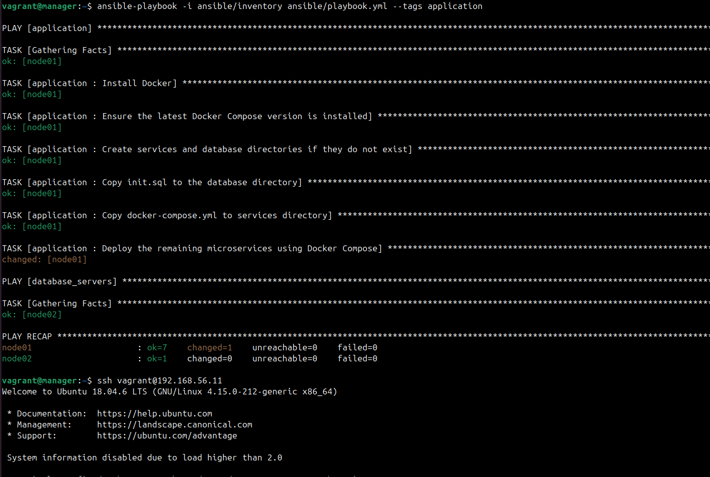
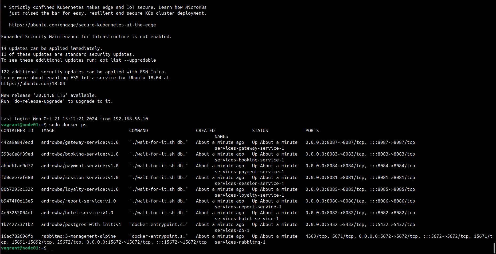

### Проверим работу сервисов через newman или в Postman

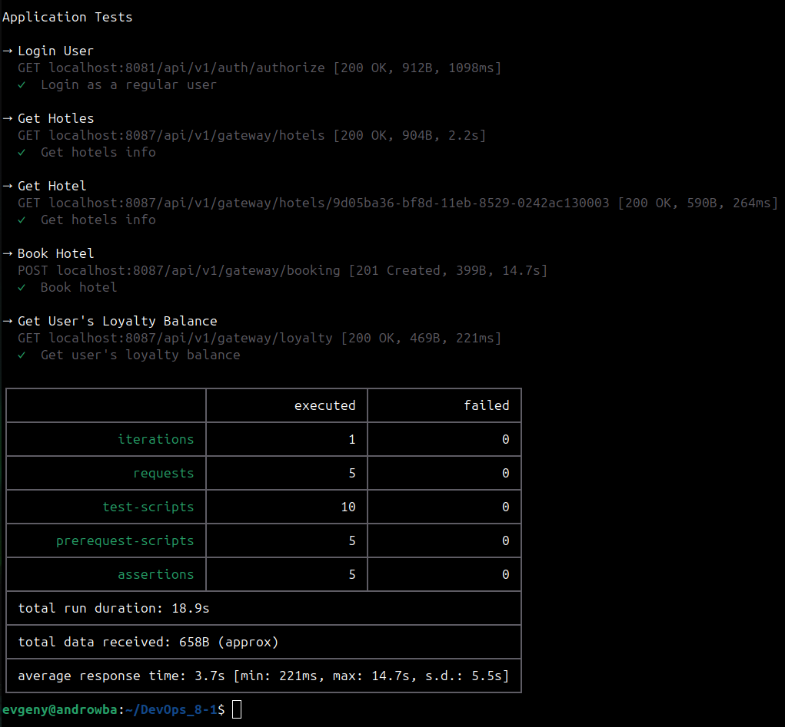
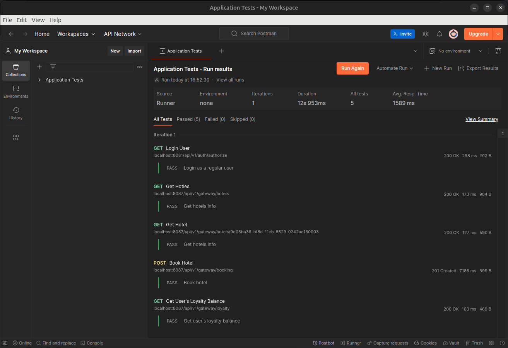

### Роль: устанавливаем и запускаем стандартный сервер apache
Apache – это свободное программное обеспечение для размещения веб-сервера.

### Для отображения сервера в веб браузере добавляем порт (в моем случае 8088) в Vagrantfile ```node02.vm.network "forwarded_port", guest: 80, host: 8088, id: "apache"``` и перезагружаем виртуfльную машину командой: ```vagrant reload node02```

### Создадим ```main.yml``` файл для установки сервера в node02

```yml
---
- name: Install Apache web server
  apt:
    name: apache2
    state: present
    update_cache: yes

- name: Ensure Apache is running and enabled at boot
  service:
    name: apache2
    state: started
    enabled: yes

- name: Create a simple index.html page
  copy:
    content: "<html><body><h1>Apache Server on Node02</h1></body></html>"
    dest: /var/www/html/index.html
    mode: '0644'
```
### Запускаем роль командой: ```ansible-playbook -i ansible/inventory ansible/playbook.yml --tags apache```
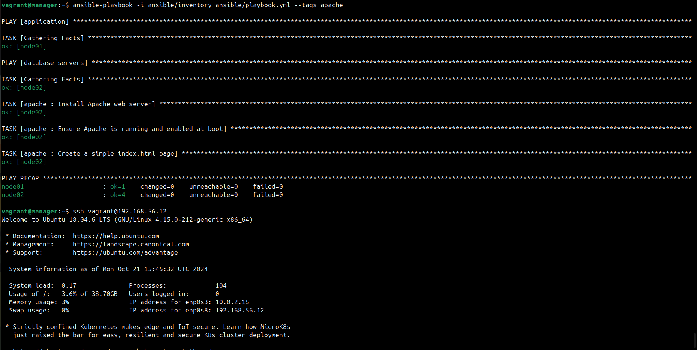

### Проверяем на node02 что все сервер в статусе running
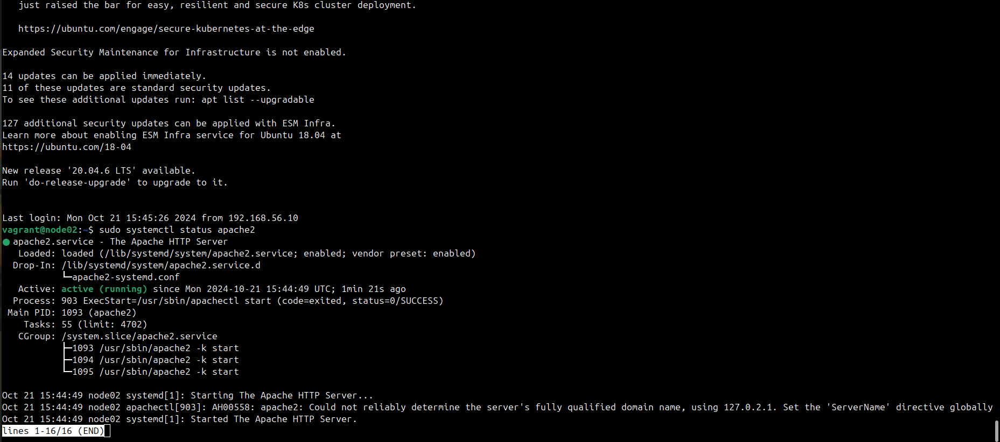


### Так выглядит сервер с кастомной страницей


### Так выглядит оригинальная страница без кастомизации
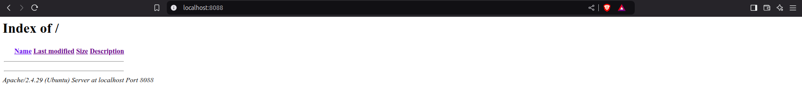

### Роль Postgres: Устанавливаем и запускаем postgres, создаем базу данных с произвольной таблицей и добавляем в нее три произвольные записи.

### Добавляем перенаправление порта для базы данных в Vagrantfile и перезагружаем машину ```node02.vm.network "forwarded_port", guest: 5432, host: 15432, id: "postgres"```

### Создадим ```main.yml``` файл для установки  и запуска Postgres в node02

```yml
- name: Install PostgreSQL
  apt:
    name: postgresql
    state: present
    update_cache: yes
  become: yes

- name: Start and enable PostgreSQL service
  service:
    name: postgresql
    state: started
    enabled: yes
  become: yes

- name: Create a new database if it doesn't exist
  shell: |
    psql -tc "SELECT 1 FROM pg_database WHERE datname = 'mydb'" | grep -q 1 || psql -c "CREATE DATABASE mydb;"
  become: yes
  become_user: postgres

- name: Create a new table in the database
  command: "psql -d mydb -c 'CREATE TABLE IF NOT EXISTS test_table (id SERIAL PRIMARY KEY, name VARCHAR(50));'"
  become: yes
  become_user: postgres

- name: Insert three records into the table if they don't already exist
  command: "psql -d mydb -c \"INSERT INTO test_table (name) SELECT unnest(ARRAY['Androwba', 'DevOps', 'Ansible']) WHERE NOT EXISTS (SELECT 1 FROM test_table WHERE name IN ('Androwba', 'DevOps', 'Ansible'));\""
  become: yes
  become_user: postgres
```
### Запустим сразу все роли командой:

```bash
ansible-playbook -i ansible/inventory ansible/playbook.yml
```
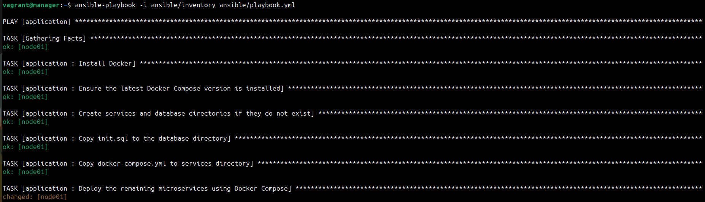
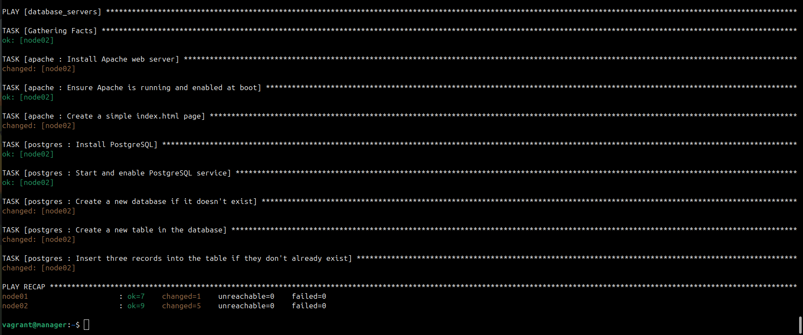

### На Node02 проверим, что Posgres установился и создал базу данных с таблицей и внес в нее записи

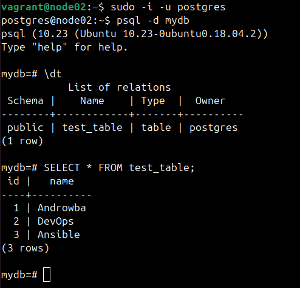

Для подключения к бд с удаленной машины убедимся, что PostgreSQL на node02 настроен на прием внешних подключений. Откроем файл конфигурации PostgreSQL ```pg_hba.conf```
Добавим следующую строку, чтобы разрешить подключения с любого IP-адреса (можно указать свой IP-адрес):
```yml
host    all             all             0.0.0.0/0               md5
```
Так же для подключения к бд без пароля можно поменять ```md5``` на  ```trust```

В файле ```postgresql.conf``` найдем и раскомментим строку: ```#listen_addresses = 'localhost'``` и поменяем 'localhost' на ```'*'``` что позволит PostgreSQL подключаться со всех IP адресов

-Изменение pg_hba.conf: гарантирует, что внешние соединения разрешены и правильно аутентифицированы. 

-Изменение postgresql.conf: гарантирует, что PostgreSQL прослушивает соединения на внешних сетевых интерфейсах, позволяя клиентам (например, на локальной машине) подключаться к нему.


### Подключаемся к базе данных на локальной машине через перенаправленный ранее порт  ```15432```
```psql -h localhost -p 15432 -U postgres -d mydb```

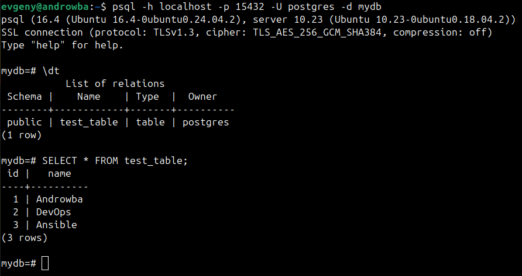

#### База данных доступна 👍

---

## Part 2: Service Discovery

### 📘 Обзор
Часть 2 знакомит с обнаружением сервисов с помощью Consul. Она руководит настройкой сервера и клиентов Consul на трех машинах Vagrant. Задачи включают написание ролей Ansible для настройки и запуска Consul для обнаружения сервисов, установку базы данных и развертывание API hotel-сервиса. С помощью Ansible playbooks мы автоматизируем настройку сервисов, включая Postgres и API hotel-сервиса, используя Consul для обнаружения сервисов между API и базой данных. Тестирование API с операциями CRUD завершает настройку.

---

### Создадим ```consul_server.hcl```

```yml
server = true
bootstrap_expect = 1
datacenter = "vagrant_dc"
data_dir = "/opt/consul/data"
log_level = "INFO"
bind_addr = "0.0.0.0"
client_addr = "0.0.0.0"
advertise_addr = "192.168.56.10"
ui = true
```

1. ```server = true```

Эта строка настраивает агент для работы в качестве сервера Consul. В Consul, сервер отвечает за поддержание состояния кластера, хранение данных и участие в выборах лидера. Эта строка необходима для настройки этой машины в качестве сервера.

2. ```bootstrap_expect = 1```

Эта настройка определяет количество серверов, которые кластер Consul ожидает инициализировать перед началом работы.

3. ```datacenter = "vagrant_dc"```

Определяет центр обработки данных, в котором работает агент Consul. Центр обработки данных в Consul — это логическое разделение служб, часто используемое для отражения физических местоположений.

4. ```data_dir = "/opt/consul/data"```

Указывает каталог, в котором Consul будет хранить свои постоянные данные (например, снимки, логи и состояние). Каталог данных необходим для серверов Consul для хранения информации о состоянии при перезапусках.

5. ```log_level = "INFO"```

Определяет уровень детализации логов для агента Consul. Доступные параметры включают TRACE, DEBUG, INFO, WARN, ERR и OFF.

6. ```bind_addr = "0.0.0.0"```

Параметр bind_addr сообщает Consul, к какому сетевому интерфейсу привязываться для входящих подключений. Установка его на 0.0.0.0 означает, что Consul будет привязываться ко всем доступным сетевым интерфейсам.

7. ```client_addr = "0.0.0.0"```

Это определяет, какой интерфейс Consul будет использовать для своих интерфейсов HTTP, DNS и RPC (т. е. с каких IP-адресов он будет принимать соединения). 0.0.0.0 позволяет ему принимать соединения со всех интерфейсов, включая сеть Vagrant.

8. ```advertise_addr = "192.168.56.10"```

IP-адрес сервера в сети Vagrant. Указывает адрес, который другие агенты Consul (клиенты и другие серверы) должны использовать для связи с этим сервером.

9. ```ui_config {enabled = true}```

Включает веб-интерфейс Consul. Интерфейс позволяет взаимодействовать с кластером Consul и контролировать его через браузер.

### Создадим ```consul_client.hcl```

В данном случае файл должен называться consul_client.hcl.j2 так как является шаблоном, нужно обращаться с ним как с шаблоном Jinja2, чтобы Ansible обрабатывал динамические переменные, даже если файл называется consul_client.hcl. Ansible не требует расширения .j2 для распознавания шаблона, поэтому файл может называться consul_client.hcl и по-прежнему функционировать как шаблон.

```yml
server = false
datacenter = "vagrant_dc"
data_dir = "/opt/consul/data"
log_level = "INFO"
bind_addr = "0.0.0.0"
client_addr = "0.0.0.0"
advertise_addr = "{{ ansible_facts['all_ipv4_addresses'] | select('search', '^192\.168\.56') | first }}"
retry_join = ["192.168.56.10"]
```

1. ```server = false```

Эта строка указывает, что этот агент Consul не является сервером. Клиент пересылает запросы на серверы, регистрирует службы и выполняет проверки работоспособности, но не хранит данные кластера и не участвует в выборах лидера.

2. ```datacenter = "vagrant_dc"```

Как и на сервере, клиент должен принадлежать к тому же логическому центру обработки данных, чтобы они могли правильно взаимодействовать.

3. ```data_dir = "/opt/consul/data"```

Клиенты не хранят состояние, как серверы, но им все равно требуется data_dir для кэширования и хранения временных данных. Эта строка гарантирует, что у клиента есть выделенное пространство для этой цели.


4. ```"{{ ansible_facts['all_ipv4_addresses'] | select('search', '^192\.168\.56') | first }}"```

{{ ... }} — синтаксис Jinja2 для шаблонизации в Ansible. Используется для вставки динамических значений в файл конфигурации на основе переменных или выражений.

ansible_facts['all_ipv4_addresses']:
ansible_facts — это словарь, содержащий различные факты (системную информацию), собранные Ansible о целевой машине. 
all_ipv4_addresses — это ключ в этом словаре, который содержит список всех адресов IPv4, назначенных сетевым интерфейсам машины.

5. ```retry_join = ["192.168.56.10"]```

Строка говорит клиенту присоединиться к существующему кластеру Consul, подключившись к указанному IP-адресу, который в данном случае является сервером Consul. Если клиент не может изначально подключиться, он будет продолжать попытки, пока не присоединится к кластеру.

### Создадим и запустим Vagrantfile с командами для установки Ansible на consul_server и python на api и db машины

```ruby
Vagrant.configure("2") do |config|
  config.vm.box = "ubuntu/jammy64"
  config.vm.synced_folder "/home/evgeny/DevOps_8-1", "/vagrant_data"

  config.vm.define "consul_server" do |server|
    server.vm.hostname = "consul-server"
    server.vm.network "private_network", ip: "192.168.56.10"
    server.vm.network "forwarded_port", guest: 22, host: 2222
    server.vm.network "forwarded_port", guest: 8500, host: 8500
    server.vm.provider "virtualbox" do |vb|
      vb.memory = "4096"
      vb.cpus = 2
    end
    server.vm.provision "shell", inline: <<-SHELL
      sudo apt-get update
      sudo apt-get install -y software-properties-common
      sudo apt-add-repository --yes --update ppa:ansible/ansible
      sudo apt-get install -y ansible
    SHELL
  end

  config.vm.define "api" do |api|
    api.vm.hostname = "api"
    api.vm.network "private_network", ip: "192.168.56.11"
    api.vm.network "forwarded_port", guest: 22, host: 2223
    api.vm.network "forwarded_port", guest: 8082, host: 8082
    api.vm.provider "virtualbox" do |vb|
      vb.memory = "4096"
      vb.cpus = 2
    end
    api.vm.provision "shell", inline: <<-SHELL
      sudo apt-get update
      sudo apt-get install -y python3 python3-pip
    SHELL
  end

  config.vm.define "db" do |db|
    db.vm.hostname = "db"
    db.vm.network "private_network", ip: "192.168.56.12"
    db.vm.network "forwarded_port", guest: 22, host: 2224
    db.vm.network "forwarded_port", guest: 8080, host: 8080
    db.vm.provider "virtualbox" do |vb|
      vb.memory = "4096"
      vb.cpus = 2
    end
    db.vm.provision "shell", inline: <<-SHELL
      sudo apt-get update
      sudo apt-get install -y python3 python3-pip
    SHELL
  end
end
```
### Поднимем машины ```vagrant up```

<p align="center">
  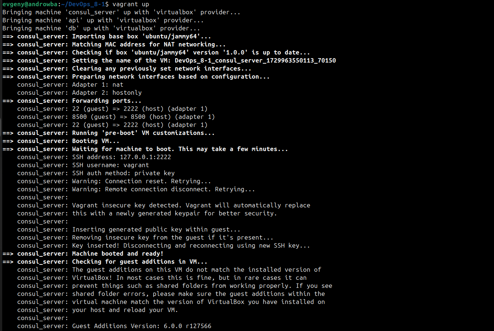
  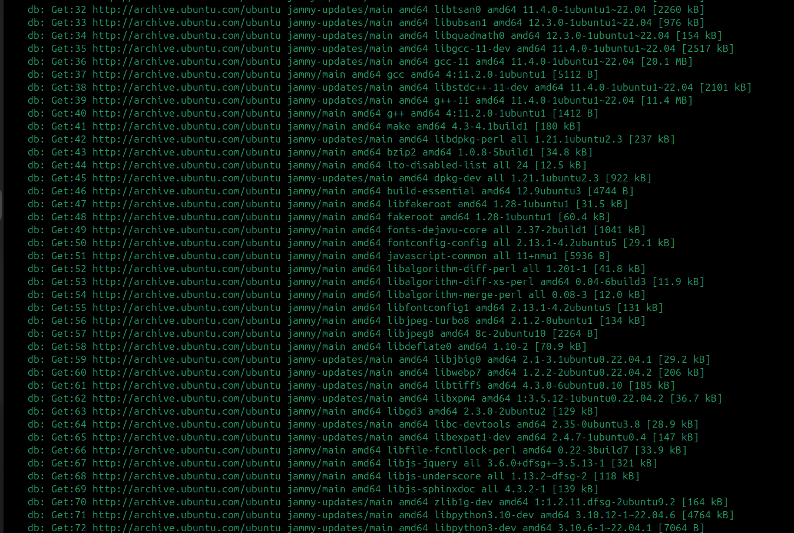
</p>

### Создание ролей. Так выглядит структура проекта:

```bash
└── ansible
    ├── inventory.ini
    ├── playbook.yml
    └── roles
        ├── install_consul_client
        │   └── tasks
        │       └── main.yml
        ├── install_consul_server
        │   └── tasks
        │       └── main.yml
        ├── install_db
        │   └── tasks
        │       └── main.yml
        └── install_hotels_service
            └── tasks
                └── main.yml
```

### Соединим машины между собой

На локальной машине выполним: ```ssh-keygen -y -f /home/evgeny/DevOps_8-1/.vagrant/machines/consul_server/virtualbox/private_key > /home/evgeny/DevOps_8-1/.vagrant/machines/consul_server/virtualbox/id_rsa.pub``` Данная команда сгенерирует открытый ключ (id_rsa.pub) на основе существующего закрытого ключа (id_rsa), и сделает это на локальной машине. Она не создает новую пару ключей; она просто выводит открытый ключ из закрытого ключа, который уже существует.

На каждой виртуальной машине скопируем public key командой :```cat /vagrant/.vagrant/machines/consul_server/virtualbox/id_rsa.pub >> ~/.ssh/authorized_keys``` так же установим правильное разрешение командой: ```chmod 600 ~/.ssh/authorized_keys```

### Создадим ```inventory.ini:``` для ansible

```ini
[all:vars]
ansible_python_interpreter=/usr/bin/python3

[consul_server]
192.168.56.10

[api]
192.168.56.11

[db]
192.168.56.12
```

```[all:vars]``` определяет переменные, которые будут применяться ко всем хостам.

```ansible_python_interpreter=/usr/bin/python3``` принудительно указывает на Python3 в качестве интерпретатора.

### Проверим связь между машинами

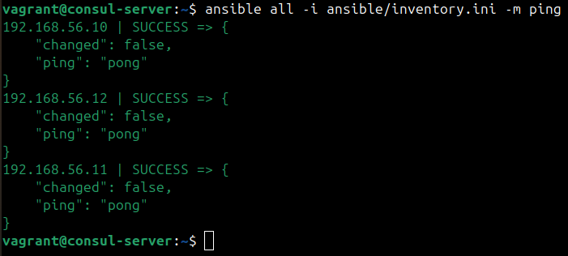

```playbook.yml:```

```yml
---
- hosts: consul_server
  become: yes
  roles:
    - role: install_consul_server
      tags: consul_server

- hosts: api,db
  become: yes
  roles:
    - role: install_consul_client
      tags: consul_client

- hosts: db
  become: yes
  roles:
    - role: install_db
      tags: db

- hosts: api
  become: yes
  roles:
    - role: install_hotels_service
      tags: hotels_service
```

```ansible/roles/install_consul_server/tasks/main.yml:```

```yml
---
- name: Install necessary packages for Consul
  apt:
    name: [curl, unzip]
    state: present
    update_cache: yes

- name: Copy Consul binary from synced folder to /tmp on VM
  copy:
    src: /vagrant/consul_1.20.0_linux_amd64.zip
    dest: /tmp/consul.zip

- name: Unzip Consul binary
  unarchive:
    src: /tmp/consul.zip
    dest: /usr/local/bin
    remote_src: yes
    mode: '0755'

- name: Create consul user and group
  user:
    name: consul
    create_home: no
    system: yes
    shell: /bin/false

- name: Create Consul data and configuration directories
  file:
    path: "{{ item }}"
    state: directory
    owner: consul
    group: consul
    mode: '0755'
  with_items:
    - /opt/consul
    - /opt/consul/data
    - /etc/consul.d

- name: Ensure consul user owns the directories
  file:
    path: "{{ item }}"
    owner: consul
    group: consul
    recurse: yes
  with_items:
    - /opt/consul
    - /opt/consul/data
    - /etc/consul.d

- name: Copy Consul server configuration file
  copy:
    src: /vagrant/consul_config/consul_server.hcl
    dest: /etc/consul.d/consul.hcl
    owner: consul
    group: consul
    mode: '0644'

- name: Create Consul systemd service
  copy:
    content: |
      [Unit]
      Description=Consul Service
      After=network.target

      [Service]
      ExecStart=/usr/local/bin/consul agent -server -bootstrap-expect=1 -data-dir=/opt/consul/data -config-dir=/etc/consul.d -bind=192.168.56.10 -client=0.0.0.0
      Restart=on-failure
      User=consul
      Group=consul
      LimitNOFILE=65536

      [Install]
      WantedBy=multi-user.target
    dest: /etc/systemd/system/consul.service
    owner: root
    group: root
    mode: '0644'

- name: Reload systemd manager configuration
  command: systemctl daemon-reload

- name: Enable and start Consul service
  systemd:
    name: consul
    enabled: yes
    state: started
```

### Можно было вместо копирования скачать Consul подобным образом но из-за санкций ссылка недоступна, Consul был скачан с VPN вручную и скопирован в VM c локальной машины с помощью Ansible

```yml
- name: Download and install Consul binary
  get_url:
    url: https://releases.hashicorp.com/consul/1.20.0/consul_1.20.0_linux_amd64.zip
    dest: /tmp/consul.zip
  register: download_result
```

### Запустим роль командой: ```ansible-playbook ansible/playbook.yml -i ansible/inventory.ini --tags "consul_server"```

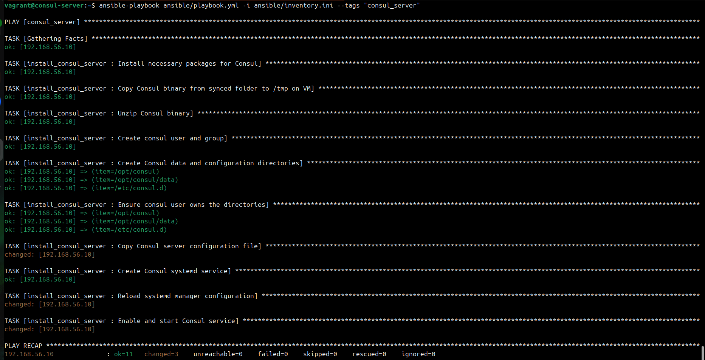

### Убедимся что Ansible установил и запустил Consul

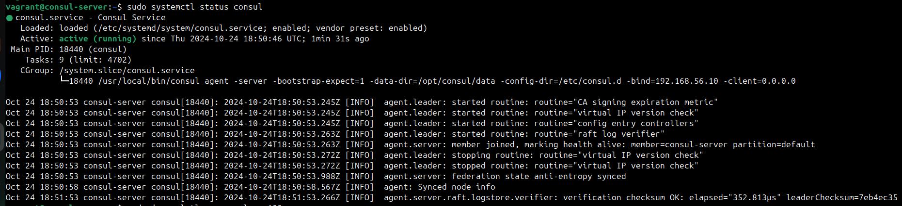

### Проверим что файл конфигурации для консула скопировался правильно а так же проверим его валидность

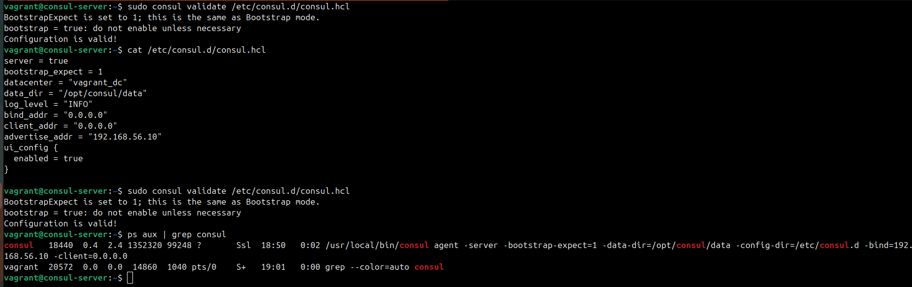

 ```/usr/local/bin/consul agent -server -config-dir=/etc/consul.d``` - данная строка подтверждает что файл используется консулом

 ### Проверим журнал на наличие ошибок

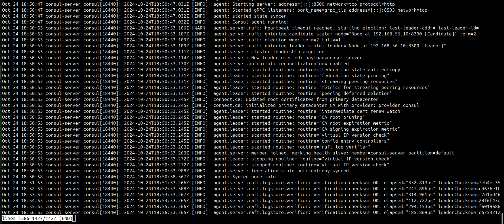

 ### Проверим доступность HTTP API с сервера

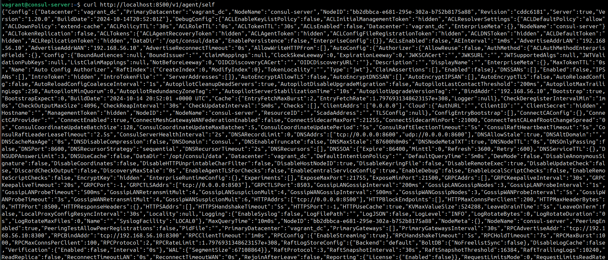

 ### Так же проверим доступность к UI в баузере на 8500 порту

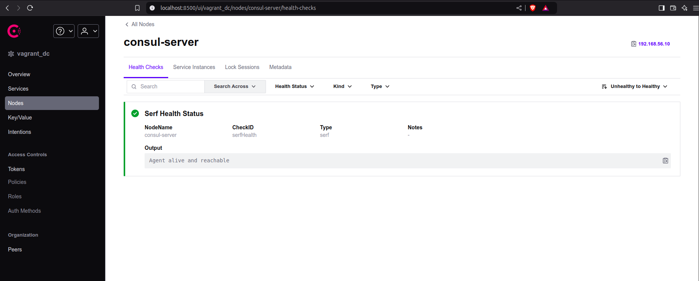

 ### Установим клиент, Consul и Envoy на api и db машины

 Cтоит обратить внимание на совместимость версий: Версия Consul1.20.x совместима с версиями envoy	1.31.x, 1.30.x, 1.29.x, 1.28.x


 Cоздадим файл конфигурации /etc/consul.d/hotel-service.json на VM машине api, который используется для регистрации hotel-service с возможностями обнаружения служб Consul и Connect.

```json
{
  "service": {
    "name": "hotel-service",
    "port": 8082,
    "connect": {
      "sidecar_service": {
        "proxy": {
          "upstreams": [
            {
              "destination_name": "postgres",
              "local_bind_port": 5432
            }
          ]
        }
      }
    }
  }
}
```

Настроив эту конфигурацию, hotel-service может положиться на Consul для безопасного управления обнаружением служб и подключениями, используя ссылки localhost, которые автоматически маршрутизируются через сервисную сетку Consul. Такой подход позволяет избежать прямых подключений по сети, что делает коммуникацию служб более безопасной и устойчивой к изменениям сети.

Важная конфигурация sidecar_service позволяет hotel-service иметь связанный sidecar proxy. Этот proxy будет обрабатывать восходящие соединения с другими сервисами (например, postgres) через сеть Consul Connect.

Дла машины db создадим /etc/consul.d/postgres.json что позволит зарегистрировать postgres для дальнейшего обнаружения.

```json
{
  "service": {
    "name": "postgres",
    "port": 5432,
    "connect": {
      "sidecar_service": {
        "proxy": {
          "config": {
            "enable_transparent_proxy": true,
            "transparent_proxy": {
              "allow_local_server": true,
              "allow_local_client": true
            }
          }
        }
      }
    }
  }
}
```


 ```yml
 ---
 - name: Install necessary packages for Consul and Envoy
  apt:
    name:
      - wget
      - unzip
      - curl
    state: present
    update_cache: yes

- name: Copy Consul binary
  copy:
    src: /vagrant/consul_1.20.0_linux_amd64.zip
    dest: /tmp/consul.zip

- name: Unzip Consul binary
  unarchive:
    src: /tmp/consul.zip
    dest: /usr/local/bin
    remote_src: yes
    mode: '0755'

- name: Download Envoy binary from GitHub
  get_url:
    url: https://github.com/envoyproxy/envoy/releases/download/v1.30.6/envoy-contrib-1.30.6-linux-x86_64
    dest: /usr/local/bin/envoy
    mode: '0755'

- name: Create consul user and group
  user:
    name: consul
    create_home: no
    system: yes
    shell: /bin/false

- name: Create Consul data and configuration directories
  file:
    path: "{{ item }}"
    state: directory
    owner: consul
    group: consul
    mode: '0755'
  loop:
    - /opt/consul
    - /opt/consul/data
    - /etc/consul.d

- name: Copy Consul client configuration file
  template:
    src: /vagrant_data/consul_config/consul_client.hcl
    dest: /etc/consul.d/consul.hcl
    owner: consul
    group: consul
    mode: '0644'

- name: Create Consul systemd service
  copy:
    content: |
      [Unit]
      Description=Consul Client Service
      After=network.target

      [Service]
      ExecStart=/usr/local/bin/consul agent -config-dir=/etc/consul.d
      Restart=on-failure
      User=consul
      Group=consul
      LimitNOFILE=65536

      [Install]
      WantedBy=multi-user.target
    dest: /etc/systemd/system/consul.service
    owner: root
    group: root
    mode: '0644'

- name: Reload systemd manager configuration
  command: systemctl daemon-reload

- name: Enable and start Consul service
  systemd:
    name: consul
    enabled: yes
    state: started

- name: Set service_name for Consul Envoy Sidecar
  set_fact:
    service_name: "{{ 'postgres' if 'db' in group_names else 'hotel-service' }}"

- name: Create Envoy sidecar systemd service
  copy:
    dest: /etc/systemd/system/consul-envoy.service
    content: |
        [Unit]
        Description=Consul Envoy Sidecar for {{ service_name }}
        After=network.target consul.service

        [Service]
        ExecStart=/usr/local/bin/consul connect proxy -sidecar-for {{ service_name }}
        Restart=on-failure
        User=root
        LimitNOFILE=65536

        [Install]
        WantedBy=multi-user.target
    owner: root
    group: root
    mode: '0644'

- name: Reload systemd manager configuration
  command: systemctl daemon-reload

- name: Enable and start Envoy sidecar service
  systemd:
    name: consul-envoy.service
    enabled: yes
    state: started
 ```

 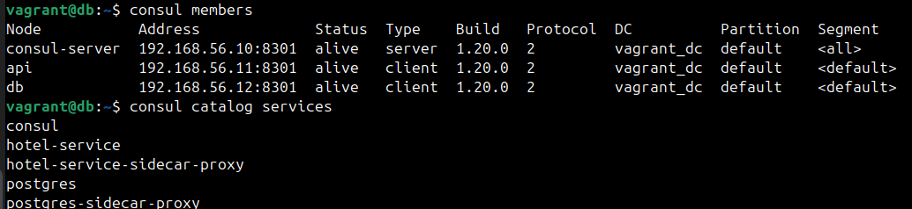

### Запустим роль командой: ```ansible-playbook ansible/playbook.yml -i ansible/inventory.ini --tags "consul_client"```

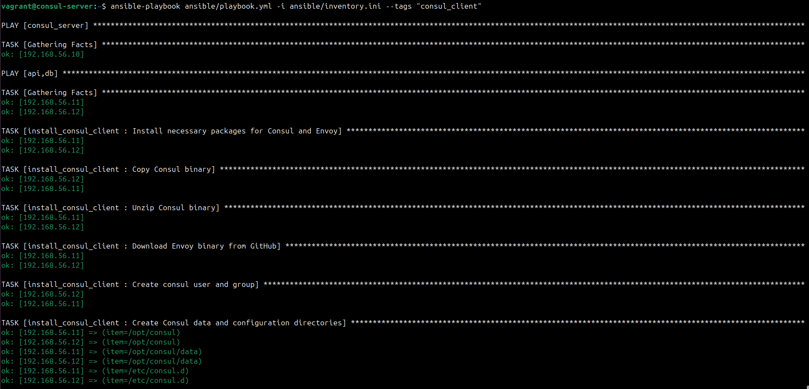
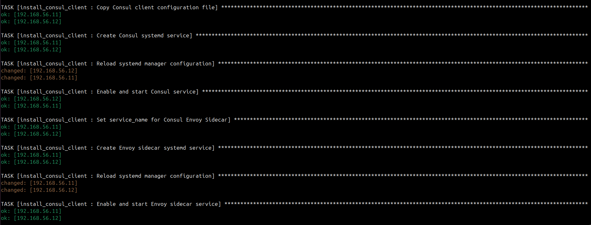
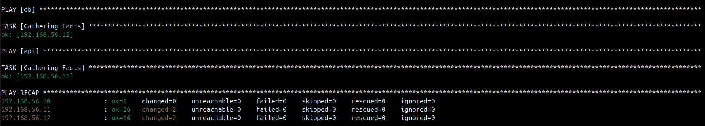

###  Проверим что все установилось и запустилось на каждой машине

```api```

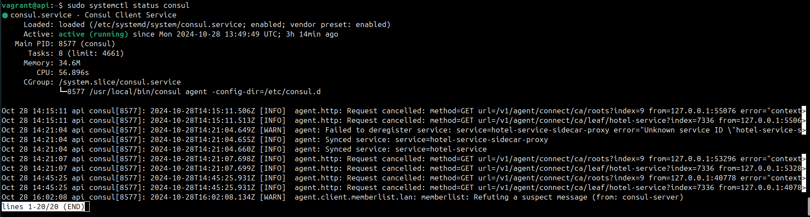

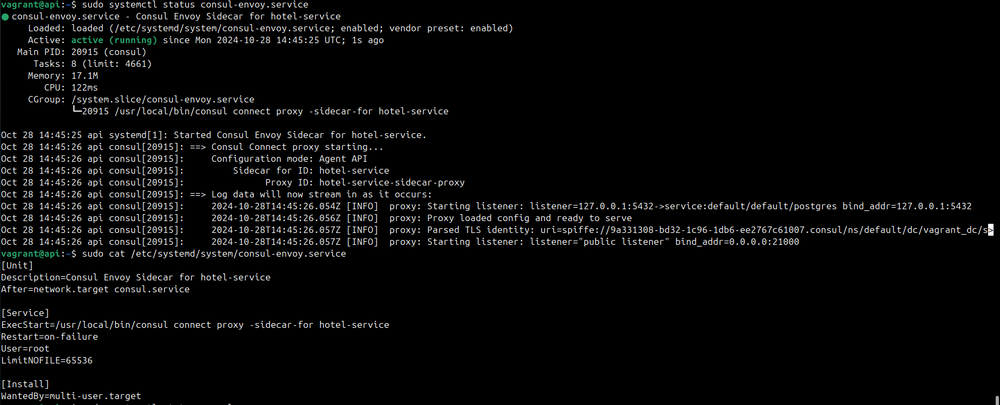

```db```

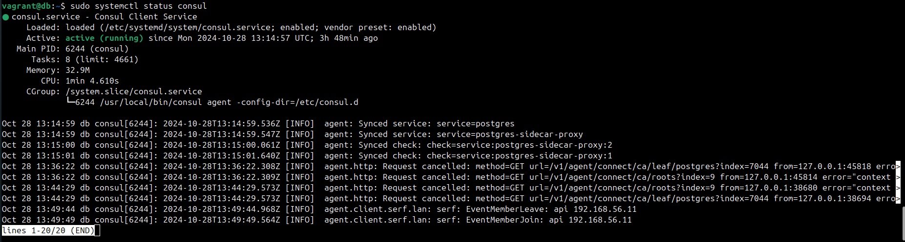


```api```

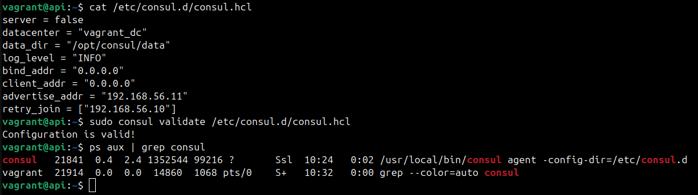

```db```

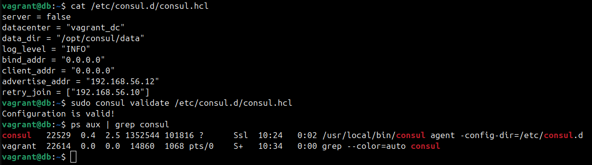

### В Consul UI появились 2 ноды: api и db

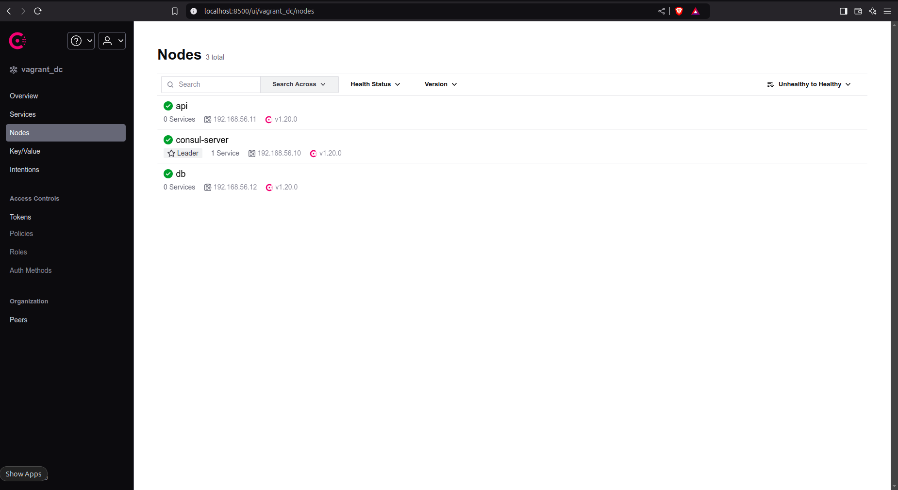

### Установим Postgres на виртуальную машину db и создадим базу данных hotels_db

```yml
---
- name: Install PostgreSQL and Python dependencies
  apt:
    name: 
      - postgresql
      - python3-psycopg2
    state: present
    update_cache: yes

- name: Ensure PostgreSQL is running and enabled on boot
  service:
    name: postgresql
    state: started
    enabled: yes

- name: Create hotels_db database
  become_user: postgres
  postgresql_db:
    name: hotels_db
    state: present
```

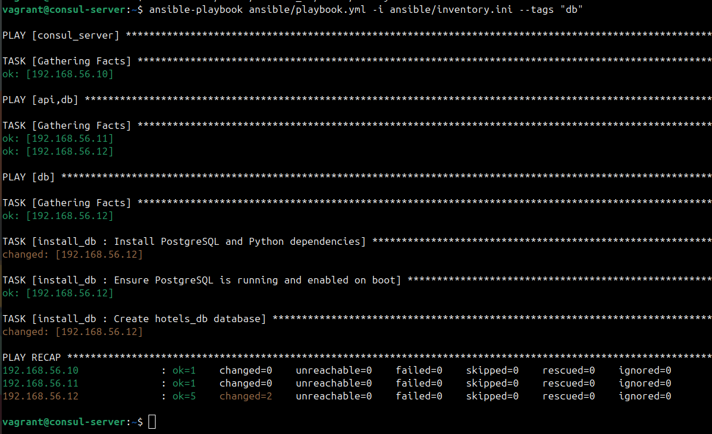

###  Проверим что Postgres установлен и запущен а база данных создана

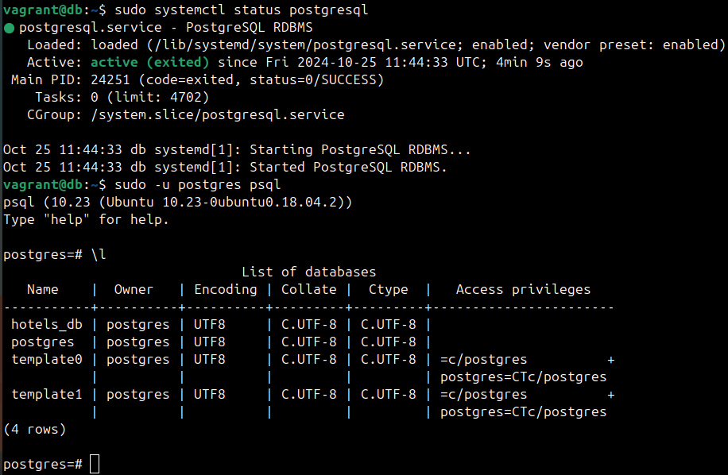

```yml
---
- name: Install OpenJDK 8
  apt:
    name: openjdk-8-jdk
    state: present
    update_cache: yes

- name: Install Maven
  apt:
    name: maven
    state: present
    update_cache: yes

- name: Copy hotel-service source code to target directory
  copy:
    src: /vagrant_data/src/services/hotel-service/
    dest: /opt/hotel-service/
    owner: vagrant
    group: vagrant
    mode: '0755'
    remote_src: yes

- name: Ensure Maven Wrapper JAR exists
  stat:
    path: /opt/hotel-service/.mvn/wrapper/maven-wrapper.jar
  register: maven_wrapper_jar

- name: Ensure mvnw is executable
  file:
    path: /opt/hotel-service/mvnw
    mode: '0755'

- name: Set environment variables for hotel service
  lineinfile:
    path: /etc/environment
    line: "{{ item }}"
  loop:
    - 'POSTGRES_HOST=127.0.0.1'
    - 'POSTGRES_PORT=5432'
    - 'POSTGRES_DB=hotels_db'
    - 'POSTGRES_USER=postgres'
    - 'POSTGRES_PASSWORD='

- name: Go offline to download dependencies
  command: mvn dependency:go-offline
  args:
    chdir: /opt/hotel-service

- name: Build the hotel-service JAR file
  command: mvn package -DskipTests
  args:
    chdir: /opt/hotel-service

- name: Start hotel-service
  shell: "java -jar /opt/hotel-service/target/hotel-service-0.0.1-SNAPSHOT.jar > /opt/hotel-service/hotel-service.log 2>&1 &"
  args:
    executable: /bin/bash

- name: Ensure hotel-service is accessible
  wait_for:
    port: 8082
    delay: 5
    timeout: 30
    state: started
```

Интеграция Consul позволяет управлять обнаружением сервиса без необходимости в статическом IP. Можно настроить глобальную переменную, указывающую на 127.0.0.1, чтобы ссылаться на PostgreSQL локально в Consul.

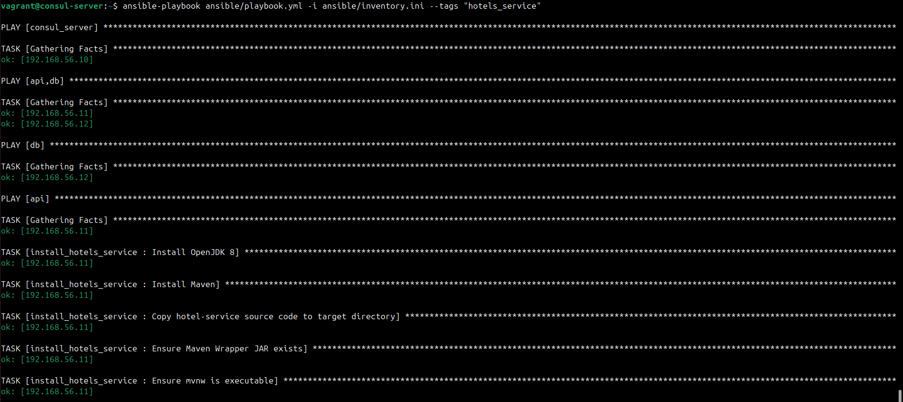
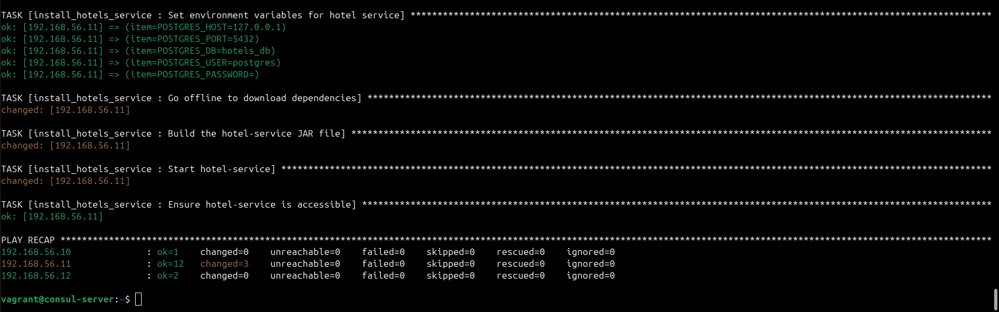

### Все скопировалось и собралось

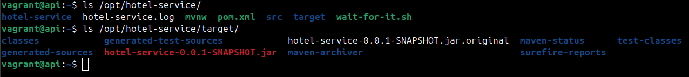

### Проверим в браузере что сервис запущен


### Убедимся что запуск сервиса создал таблицы в базе данных

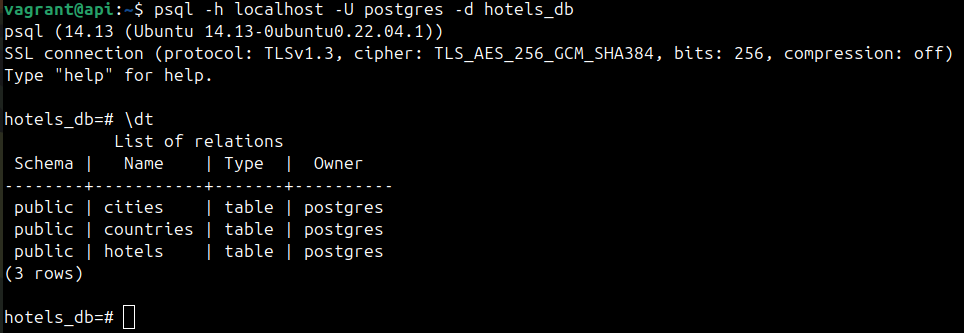

### CRUD тесты

Создадим роль для тестов которые будут добавлять, обновлять и удалять данные из бд.

В playbook добавим запись: 

```yml
- hosts: api
  become: yes
  vars:
    postgres_user: "postgres"
    database_name: "hotels_db"
  roles:
    - role: crud_tests
      tags: crud
```
Создадим main.yml

```yml
---
- name: Create a new hotel record
  postgresql_query:
    db: "{{ database_name }}"
    login_host: "localhost"
    login_user: "{{ postgres_user }}"
    query: "INSERT INTO hotels (hotel_id, address, cost, hotel_uid, hotel_name, rooms, city_id) VALUES (4000, 'Address 4', 4500, gen_random_uuid(), 'Hotel 4', 150, 1000);"
  register: insert_result

- name: Delay for checking insert operation
  wait_for:
    timeout: 10

- name: Update the hotel record
  postgresql_query:
    db: "{{ database_name }}"
    login_host: "localhost"
    login_user: "{{ postgres_user }}"
    query: "UPDATE hotels SET cost = 5000 WHERE hotel_id = 4000;"
  register: update_result

- name: Delay for checking update operation
  wait_for:
    timeout: 10

- name: Delete the hotel record
  postgresql_query:
    db: "{{ database_name }}"
    login_host: "localhost"
    login_user: "{{ postgres_user }}"
    query: "DELETE FROM hotels WHERE hotel_id = 4000;"
  register: delete_result
```

Запустим тесты командой: ```ansible-playbook ansible/playbook.yml -i ansible/inventory.ini --tags "crud"```

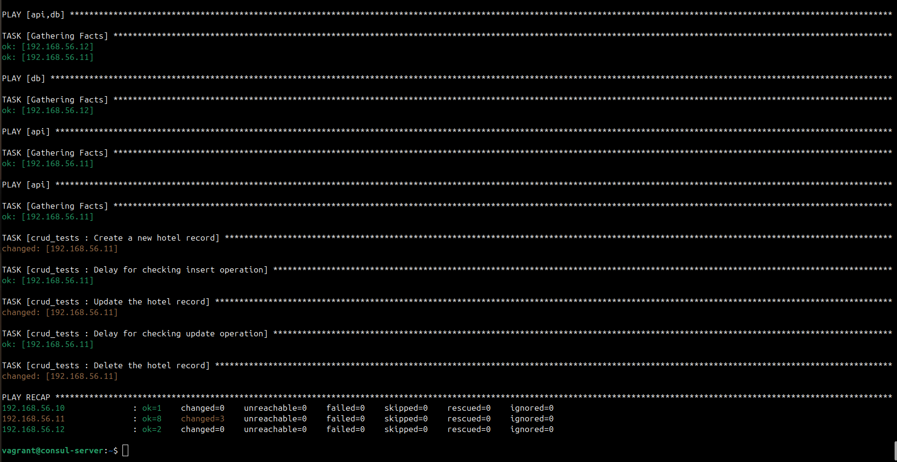

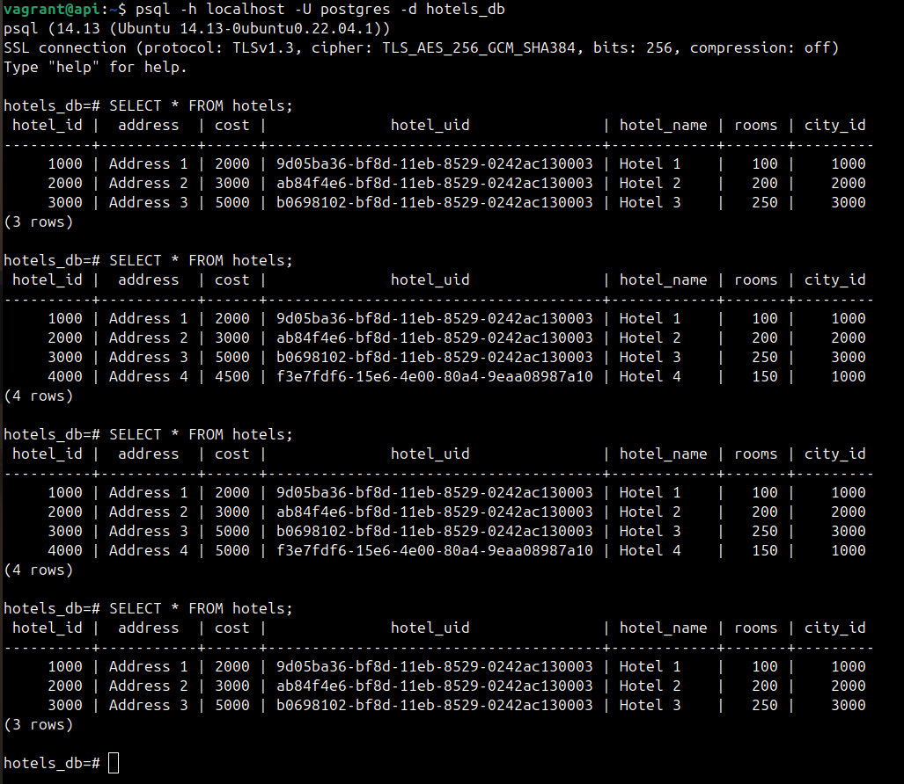


